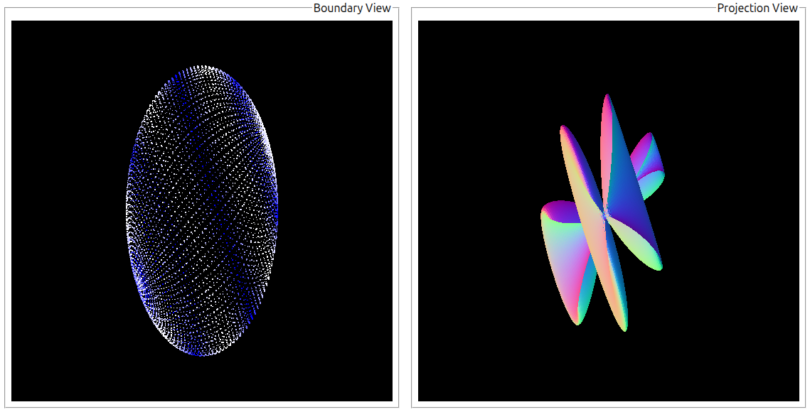

# HoloField - Boundary-to-Volume Generator

HoloField is an experimental framework for transforming mathematical descriptions of two-dimensional surfaces into three-dimensional volumetric geometry.

The project establishes a pipeline in which a **2D boundary field** is transformed into a continuous **3D scalar field**, sampled into a volumetric dataset, and ultimately converted into renderable geometry. Rather than treating 3D geometry generation as a single operation, HoloField separates the process into distinct, modular stages for **projection, sampling, data representation, and surface extraction**.



## Concept

Conceptually, the pipeline is:

**Boundary Field → Decoder → Sampler → Dataset → Mesh Generator**

There is a modular separation of responsabilities:

* **Boundary fields** describe the source geometry.
* **Decoders** determine how the source geometry is transformed into 3D space.
* **Samplers** determine how the continuous result is discretized.
* **Datasets** hold the intermediate representation and analysis of the generated data.
* **Mesh generators** determine how a renderable surface is extracted.

The same boundary field can therefore be passed through different combinations of decoders, samplers, and mesh generators without changing its original definition.

Different mathematical fields, spatial transformations, sampling resolutions, and surface extraction algorithms can be compared while keeping the rest of the pipeline unchanged.

The central idea is to treat the transformation from 2D to 3D as a set of distinct and interchangeable operations, rather than embedding the transformation directly into a geometry-generation algorithm.

A useful mental model is that the transformation works as *projection lens*: the boundary field encodes the original shape information, while the decoder determines how that information is transformed into three-dimensional space. Different decoders (or *lenses*) can therefore produce different volumetric interpretations of the same boundary without changing the underlying field.

This allows relatively simple mathematical functions to become experimental 3D shapes through different spatial transformations. Sampling strategies then determine the resolution and aspect of the final 3D model.

## Origin of the Idea

The project originated from a more abstract question:

**How can information describing an outside influence be transformed into the structure of an inner world?**

This led to an analogy with the **holographic principle in Physics**, in which information associated with a boundary or lower-dimensional description can encode information about a higher-dimensional volume.

HoloField borrows the conceptual direction of that relationship, but not the physical theory itself. In the holographic principle, a lower-dimensional boundary can provide an informational description of a higher-dimensional volume, with the volume potentially understood as emerging from that lower-dimensional description. HoloField explores a parallel computational relationship: a lower-dimensional mathematical description is used as the **source from which a three-dimensional volume is constructed**.

In this sense, HoloField's "hologram" is not a holographic generator modelling light behaviour and does not attempt to reproduce the holographic principle. It is a computational analogy in which a lower-dimensional boundary representation acts as the information source for generating a higher-dimensional structure.

## Natural Parallels

The individual techniques used by HoloField are well established.

Mathematical **implicit surfaces** and **signed scalar fields** are commonly used to describe three-dimensional shapes. **Volumetric sampling** converts continuous fields into discrete voxel representations, while algorithms such as **Marching Cubes** and **Dual Contouring** extract polygonal surfaces from those volumes. Similar concepts are also found in procedural modelling, scientific visualization, ray marching, and volume rendering.

In this respect, HoloField does not attempt to reinvent these underlying techniques. Instead, it experiments with how they can be composed into a more general and modular transformation pipeline.

## Scope and Approach

HoloField is designed as an experimental and composable system rather than a single-purpose shape generator. Its components are deliberately kept independent so that individual stages can be examined, replaced, and recombined without requiring the rest of the system to change.

This gives the project several defining characteristics:

- Modularity: each stage of the generation pipeline has a focused responsibility and can be replaced independently.

- Composability: different fields, decoders, samplers, and geometry generators can be combined to explore their interactions.

- Inspectability: intermediate datasets and diagnostic statistics make the generated data available for examination rather than treating the final mesh as the only result.

- Experimentation: unusual or unexpected combinations are part of the exploration, allowing the behaviour of individual components and their interactions to be observed.

- Extensibility: new mathematical fields, spatial transformations, sampling strategies, representations, and surface extraction methods can be introduced without redesigning the entire pipeline.

The result is an environment in which the generation process itself is an object of exploration: not only what geometry is produced, but how different mathematical descriptions and computational stages influence the resulting representation.

## Objective

The primary objective of HoloField is to implement this separation of concerns and introduce a **3D generation system and an experimental framework**. In this framework the relationship between **mathematical description, spatial projection, volumetric representation, and extracted geometry** can be explored independently. Rendering provides the immediate visual result, while the datasets and diagnostic statistics (partially implemented) describe how the mathematical field is being sampled.

At the same time, the project provides a controlled environment for experimenting with different mathematical fields, spatial transformations, sampling strategies, data representations, and surface extraction algorithms while keeping the stages of the pipeline independently replaceable.

The longer-term objective is to introduce increasingly sophisticated mathematical descriptions and decoding algorithms that explore computational analogues of characteristics associated with holographic systems. In particular, future decoders may implement:

- Non-locality: boundary regions can influence volume beyond their immediate spatial correspondence, potentially depending on information from other regions.

- Distributed encoding: information about a volumetric region can be represented across multiple, spatially separated regions of the boundary.

- Redundancy: multiple boundary regions can independently or collectively contribute to the same volumetric structure.

- Dimensional emergence: increasingly complex 3D structures emerge from a lower-dimensional description rather than through direct extrusion or local projection.

## Technical Demonstration

HoloField also serves as a technical demonstration of some of the engineering practices required to turn a project into a documented and consumable software system.

The project uses **TypeScript and TypeDoc** to combine API-level documentation written alongside the source code with higher-level conceptual documentation maintained in Markdown. These two layers are cross-linked where implementation details require additional explanation, allowing the generated API documentation to serve as an entry point into descriptions of the broader concepts behind the system - and vice-versa.

The project also exposes major components through **REST API endpoints**, with **OpenAPI/Swagger** providing a public description of those interfaces. The OpenAPI schema is validated as part of the development workflow, keeping the API implementation and its formal specification aligned.

This documentation and API layer is intentionally part of the project rather than an afterthought. The objective is to demonstrate the ability to take experimental code and structure it into a system that can be understood, inspected, and consumed through documented interfaces.

Future releases will extend this engineering layer further, particularly through **automated testing** and broader validation of the individual pipeline components.

## How to Run

HoloField can be explored directly through its **GitHub Pages** deployment without installing or running the project locally.

For local execution, HoloField requires:

* **Node.js** — current LTS version recommended
* **npm** — included with Node.js
* A modern web browser with WebGL support

No additional database, server software, or external services are required.

Download or clone the repository, make sure **Node.js and npm** are installed, then install the project dependencies:

```bash
npm install
```

Start the local Express server:

```bash
npm run server
```

These commands work on Windows, Linux, and macOS.

Once the server is running, open a browser and navigate to:

[**http://localhost:3000**](http://localhost:3000)

The HoloField interface will be served by the Express application and ready to use when the page loads.

The Engine documentation is available [here](/docs/code/index.html). You can also browse the 'Concepts' section directly in Markdown [here](/docs/concepts/architecture.md).

For the REST API, Swagger is available at http://localhost:3000/api/docs.
A list of every exposed endpoint is also available at http://localhost:3000/api.

The Express server runs locally on your computer and listens on `localhost`. It is intended for local use and does not expose the application to external network connections and does not access any files outside the project folder.

## Technologies & Acknowledgements

HoloField uses the following open-source technologies:

* **Three.js** for 3D rendering and visualization.
* **TypeDoc** for generating the API documentation from JSDoc annotations and Markdown documentation files.
* **OpenAPI / Swagger** for documenting and validating the REST API.

The Marching Cubes triangle lookup table was copied from the implementation provided by Three.js.

This project was developed with help and guidance from ChatGPT.

## License

HoloField is licensed under the MIT License.

See the [LICENSE](LICENSE) file for the full license text.